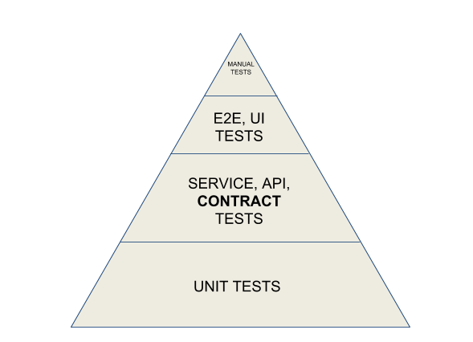
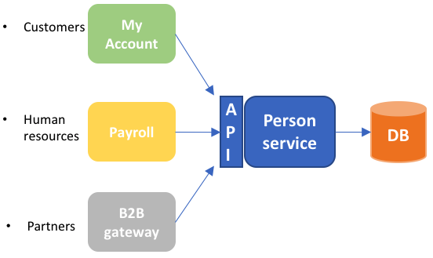
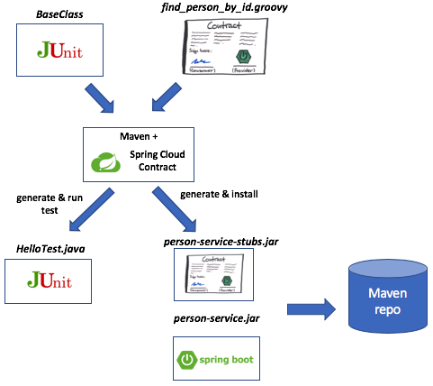
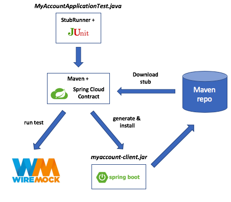
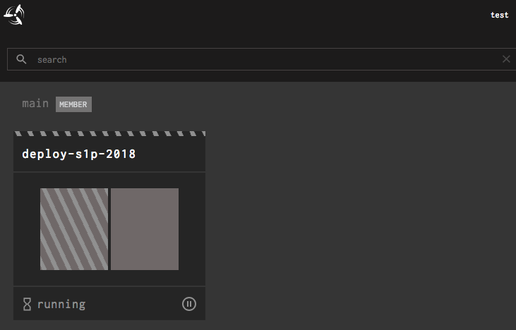
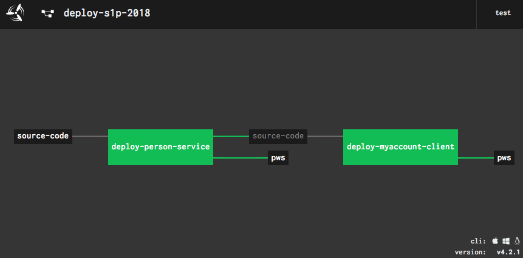
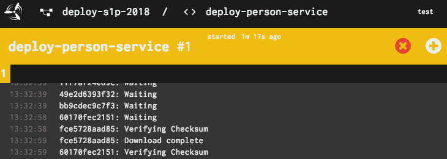

## Pre-requisites
In order to complete this lab, you will need the following:
1) A [Pivotal Web Services](https://run.pivotal.io) account
1) [Spring Tool Suite](https://spring.io/tools) or your preferred Java/Spring IDE
1) Lastes version of [Maven](https://maven.apache.org/)
1) Latest version of [Git client](https://git-scm.com/)
1) Latest version of [Docker](https://www.docker.com/) and [Docker Compose](https://docs.docker.com/compose/)
1) Latest version of [Concourse's fly command-line tool](https://github.com/concourse/fly)

## Contract Testing
Dev teams frequently need to make schema changes and/or functionality changes to existing services.
The main challenge is: __How do you do that without impacting your existing consumers?__ Pivotal's recommendation is to leverage Consumer-driven contracts. That way, based on a common API contract, you can run integration tests between the consumer and a mock provider; and, between the real provider and a mock consumer; __alll of this without setting up all your upstream or downstream systems__. 
The main goal is to fail the build of the application when there is faulty integration, so together with unit and integration tests, your contract tests must have a place in your test suite.



## Who should use consumer-drive contracts?
This pattern is applicable in the context of either a single enterprise or a closed community of well-know services where providers have some influence over how consumers establish contracts with them.

## Contract Testing with Spring Cloud Contract
With Spring Cloud Contract, you can successfully implement Consumer-driven Contracts for both JVM-based apps and [non-JVM apps](https://spring.io/blog/2018/02/13/spring-cloud-contract-in-a-polyglot-world). To understand Spring Cloud Contract concepts, let's use it in the context of two (2) Spring Boots apps:

1) The `PersonService` app (a.k.a. the producer) which provides an API to find a given person using his or her ID
1) The `MyAccount` app (a.k.a. the consumer) which accesses that API to get said person's names, email and phone. 



## Getting started
1) Create a folder in the filesystem and `cd` to it
1) `git clone https://github.com/Pivotal-Field-Engineering/s1p-2018-contract-testing.git`
1) Import it as an _Existing Maven project_ into your IDE. Choose the `s1p-2018-contract-testing` folder as the `Root Directory`

## Build the `PersonService` app
During the current Sprint, the `PersonService` team has created the contract test's parent class: [BaseClass](person-service/src/test/java/hello/BaseClass.java).

In parallel, the `MyAccount` team created the consumer-driver contract [find_person_by_id.groovy](person-service/src/test/resources/contracts/hello/find_person_by_id.groovy); and provided it to the `PersonService` team, which included the contract definition in the `PersonService` codebase.

Feel free to review both BaseClass and the consumer contract using your IDE.

We are ready to build the app via these commands:
```
cd <YOUR_FOLDER>/s1p-2018-contract-testing/person-service
mvn clean package
```
This picture depicts what happens when you build the app:


1) The [Maven build](person-service/pom.xml) and Spring Cloud Contract Verifier use the contract definition to _automatically generate_ full tests
1) You can use your IDE to view the source code of the generated test at: `/person-service/target/generated-test-sources/contracts/hello/HelloTest.java`
1) Once Spring Cloud Contract verifies that `PersonService` implementation is compliant with the contract, Maven generates and installs both Stubs (`person-service-0.0.1-SNAPSHOT-stubs.jar`) and the `PersonService` app (`person-service-0.0.1-SNAPSHOT.jar`) artifacts in the designated Maven repo

## Build the `MyAccount` app
During the same Sprint, the `MyAccount` app has also created a [consumer-driven contract test](/myaccount-client/src/test/java/hello/MyAccountApplicationTest.java) to ensure the integration with the `PersonService` app is aligned with the specifications.

Let's build the app:
```
cd <YOUR_FOLDER>/s1p-2018-contract-testing/myaccount-client
mvn clean package
```
This picture depicts what happens when you build the app:



1) When the [Maven build](/myaccount-client/pom.xml) is executed, the Spring Cloud Contract Stub Runner in your JUnit test will automatically download the required stubs from the designated Maven repo
1) The Spring Cloud Contract Stub Runner will also automatically start a WireMock server inside your test and feed it with the stubs it downloaded in the previous step
1) Once Spring Cloud Contract verifies that `MyAccount` implementation is compliant with the contract, Maven generates and installs `myaccount-client-0.0.1-SNAPSHOT.jar` in the designated Maven repo

## Service evolution: Change `PersonService` endpoint from `/person` to `/people`
1) Open your IDE
1) Find the `findPersonById` method in the [PersonRestController](/person-service/src/main/java/hello/PersonRestController.java) 
1) Change its annotation from `@GetMapping("/person/{id}")` to `@GetMapping("/people/{id}")`. Save your changes.
1) Build the `PersonService` app
1) Was the build successful or it failed? Why?
1) Change its annotation back to `@GetMapping("/person/{id}")`. Save your changes
1) Build the `PersonService` app

## Service evolution: Change `Person` schema attribute from `surname` to `lastname`
1) Open your IDE
1) Find the [Person class](/person-service/src/main/java/hello/Person.java) 
1) Use your IDE to replace the `surname` string with `lastname`. Save your changes
1) Build the `PersonService` app
1) Was the build successful or it failed? Why?
1) Use your IDE to replace the `lastname` string with `surname`. Save your changes
1) Build the `PersonService` app


## Use CI/CD pipeline with Concourse
Now that we are happy with our local test, we need to deploy both `PersonService` and `MyAccount` apps to production on Pivotal Web Services. Let's get started.

In a new Terminal window, check if Concourse is already running
```
docker ps
```
If Concourse is running, you will see results similar to these:
```
CONTAINER ID        IMAGE                 COMMAND                  CREATED             STATUS              PORTS                    NAMES
71d8a710ebb1        concourse/concourse   "/usr/local/bin/dumb…"   23 hours ago        Up 23 hours         0.0.0.0:8080->8080/tcp   s1p-2018-contract-testing_concourse_1
21cb03f9e3a7        postgres              "docker-entrypoint.s…"   23 hours ago        Up 23 hours         5432/tcp                 s1p-2018-contract-testing_concourse-db_1
```
If Concourse is not running, issue this command
```
cd <YOUR_FOLDER>/s1p-2018-contract-testing
docker-compose start
```
Now login to Concourse via the `fly` command-line: 
```
fly login -t s1p -u test -p test -c http://127.0.0.1:8080
```

Customize the Concourse [parameters](ci/params.yml) file with your Pivotal Web Services settings. For example:
```
USERNAME: abc@gmail.com
PASSWORD: n01d3@
ORG: S1Pdemo1
SPACE: development
PERSON-SERVICE-APP-NAME: gt-person-service
MYACCOUNT-CLIENT-APP-NAME: gt-myaccount-client
```
Set the pipeline and unpause it
```
cd <YOUR_FOLDER>/s1p-2018-contract-testing/ci
fly -t s1p set-pipeline -p deploy-s1p-2018 -c pipeline.yml -l params.yml
fly -t s1p unpause-pipeline --pipeline deploy-s1p-2018
```
In your browser, go to [http://127.0.0.1:8080](http://127.0.0.1:8080/) with test/test as username and password.
Select the `deploy-s1p-2018` pipeline.



You should now see the entire pipeline as shown below



To trigger the Concourse deployment pipeline, choose the `deploy-person-service` box and the hit the `+` sign on the right hand corner.



Wait a few minutes until the pipeline finishes deploying both apps to PWS.

To access the `PersonService`, access this URL: `https://PERSON-SERVICE-APP-NAME.cfapps.io/person/1`. You should get this result:
```
{"id":1,"name":"Person","surname":"One"}
```

To access the `MyAccount` app, access this URL: `https://MYACCOUNT-CLIENT-APP-NAME.cfapps.io/message/1`. You should get this result:
```
Hello Person One
```
That's all. Well, for now.

# Resources
If you would like to take a deeper dive, please take a look at [Marcin's car rental example](https://github.com/marcingrzejszczak/sc-contract-car-rental)
